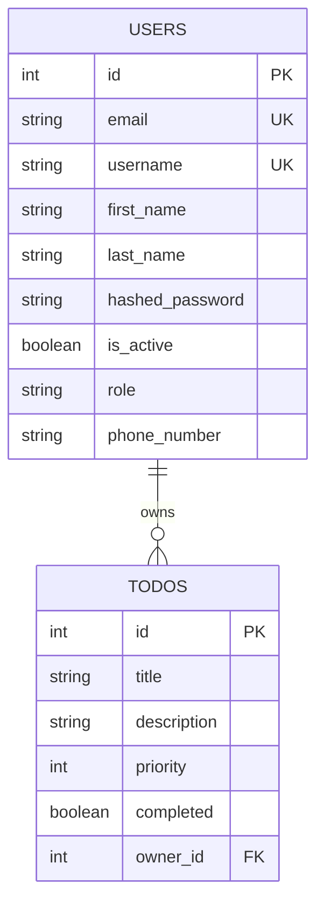

# 📝 Full-Stack Todo Application (FastAPI & PostgreSQL)

[](https://www.python.org/)
[](https://fastapi.tiangolo.com/)
[](https://www.postgresql.org/)
[](https://www.sqlalchemy.org/)
[](https://docs.pydantic.dev/)
[](https://docs.pytest.org/)

A full-stack FastAPI Todo application demonstrating REST API development, JWT/OAuth2 authentication, role-based access control, relational database modeling with SQLAlchemy and PostgreSQL, Pydantic request validation, and automated testing with pytest.

---

## 📌 Project Overview & Learning Objectives

This project was developed as part of a comprehensive FastAPI mastery course. The primary focus of the work and personal expertise is on **backend architecture, API design, security, and automated testing**.

> **Note on Frontend**: The frontend UI templates (`templates/` and `static/`) were provided by the course instructor to visualize end-to-end interactions. The core implementation and mastery demonstrated here reside in the **FastAPI backend, database layer, authentication mechanism, and test suites**.

### Core Concepts & Skills Acquired
- **FastAPI Framework**: Modular routing (`APIRouter`), request validation, response models, and Dependency Injection.
- **Security & JWT Authentication**: Password hashing via Bcrypt, OAuth2 password flow, JWT generation/validation (`python-jose`), and cookie/header token handling.
- **Role-Based Access Control (RBAC)**: Differentiating permissions between regular users and administrators.
- **Relational Data Modeling (SQLAlchemy)**: Declarative models, foreign keys, database session lifecycles, and PostgreSQL integration via `psycopg`.
- **Testing & Test-Driven Development (TDD)**: Comprehensive unit and integration testing with `pytest`, FastAPI `TestClient`, fixture management, and database dependency overriding using SQLite.

---

## 🚀 Key Features

### 1. Authentication & Security (`router/auth.py`)
- User registration with validation (`email`, `username`, `password`, `first_name`, `last_name`, `role`, `phone_number`).
- Bcrypt password hashing using `passlib.context.CryptContext`.
- Token issuance (`/auth/token`) returning HS256-signed JSON Web Tokens (JWT) with configurable expiration (`timedelta`).
- Reusable `get_current_user` dependency for securing routes and extracting user identity/claims.

### 2. Todo Management (`router/todos.py`)
- **Scoped CRUD Operations**: Users can only create, view, update, and delete their own tasks.
- Input validation with Pydantic: `title` length, `description` constraints, and `priority` limits (1–5).
- Web page rendering with Jinja2 templates and cookie-based authentication.

### 3. User Management (`router/users.py`)
- User profile retrieval.
- Secure password change endpoint with current password verification.
- Phone number update endpoint.

### 4. Admin Privileges (`router/admin.py`)
- Restricted endpoints accessible only to users with the `admin` role.
- Global access to view all users' tasks and delete any task across the database.

### 5. Automated Testing Suite (`test/`)
- Isolated test environment using SQLite (`StaticPool`, in-memory/file).
- Dependency injection overrides (`app.dependency_overrides`) for clean separation between production (PostgreSQL) and testing (SQLite).
- Setup and teardown fixtures (`@pytest.fixture`) ensuring clean database states between test executions.
- Broad test coverage across health checks, auth flows, user operations, todo CRUD, and admin privileges.

---

## 🏗️ Architecture

The application follows a clean, modular architecture separating API endpoints, business logic, validation, and data persistence:

```text
Client (Browser / REST Client)
  ↓
FastAPI Application
  ├── Routers (auth, todos, users, admin)
  ├── Authentication / JWT (python-jose, passlib)
  ├── Dependency Injection (get_db, get_current_user)
  └── Pydantic Validation (schemas & constraints)
  ↓
SQLAlchemy ORM (declarative models & sessions)
  ↓
PostgreSQL Database
```

---

## 🔐 Security

Security is integrated directly into the request lifecycle using FastAPI dependencies:

- **Bcrypt Password Hashing**: Passwords are never stored in plaintext; salted hashes are generated and verified via Passlib's `CryptContext`.
- **OAuth2 Password Flow**: Implements standard `OAuth2PasswordBearer` and `OAuth2PasswordRequestForm` for user credential exchange.
- **JWT Authentication**: Generates signed HS256 tokens holding user identity (`sub`), `user_id`, and `role`, validated on each protected request.
- **Current-User Dependency**: The `get_current_user` dependency decodes and validates incoming tokens, rejecting invalid or expired tokens with `HTTP 401 Unauthorized`.
- **Protected Endpoints**: Sensitive routes require authentication dependency injection, preventing unauthenticated access.
- **Role-Based Access Control (RBAC)**: Admin endpoints enforce role checking (`role == "admin"`) to prevent unauthorized privilege escalation.
- **Pydantic Input Validation**: Strictly typed schemas sanitize incoming request payloads and guard against malformed data.

---

## 📂 Project Structure

```text
TodoApp/
│
├── database.py              # SQLAlchemy database engine and SessionLocal setup
├── main.py                  # FastAPI application entrypoint, router mounting, static files
├── models.py                # SQLAlchemy ORM models (Users, Todos)
├── requirements.txt         # Project dependencies
├── testdb.db                # SQLite database utilized for testing
│
├── router/                  # API and page route handlers
│   ├── __init__.py
│   ├── admin.py             # Admin-only endpoints (view all, delete any)
│   ├── auth.py              # User authentication, JWT issuance, login/register
│   ├── todos.py             # Todo CRUD operations and template rendering
│   └── users.py             # User profile, password reset, and phone number updates
│
├── templates/               # Jinja2 HTML templates (Instructor-provided UI)
│   ├── add-todo.html
│   ├── edit-todo.html
│   ├── home.html
│   ├── layout.html
│   ├── login.html
│   ├── navbar.html
│   ├── register.html
│   └── todo.html
│
├── static/                  # Static assets (Bootstrap, custom CSS, JS)
│   ├── css/
│   │   ├── base.css
│   │   └── bootstrap.css
│   └── js/
│       ├── base.js
│       └── bootstrap.js
│
└── test/                    # Pytest test suite
    ├── __init__.py
    ├── utils.py             # Test database setup, client fixture, mock users/todos
    ├── test_main.py         # Application health check tests
    ├── test_auth.py         # Authentication logic and JWT generation tests
    ├── test_todos.py        # Todo CRUD integration tests
    ├── test_admin.py        # Admin permission and action tests
    └── test_users.py        # User profile and password update tests
```

---

## 🛠️ Database Schema



---

## 🔌 API Endpoints Summary

### System & Health
| Method | Endpoint | Description | Auth Required |
|---|---|---|---|
| `GET` | `/` | Redirects to `/todos/todo-page` | No |
| `GET` | `/healthy` | Health check endpoint returning `{ status: "healthy" }` | No |

### Authentication (`/auth`)
| Method | Endpoint | Description | Auth Required |
|---|---|---|---|
| `POST` | `/auth/` | Register a new user | No |
| `POST` | `/auth/token` | Obtain access token (OAuth2 form login) | No |
| `GET` | `/auth/login-page` | Render login HTML page | No |
| `GET` | `/auth/register-page` | Render registration HTML page | No |

### Todos (`/todos`)
| Method | Endpoint | Description | Auth Required |
|---|---|---|---|
| `GET` | `/todos/` | List all todos for current user | Bearer Token |
| `GET` | `/todos/todo/{todo_id}` | Retrieve specific todo by ID | Bearer Token |
| `POST` | `/todos/todo` | Create a new todo | Bearer Token |
| `PUT` | `/todos/todo/{todo_id}` | Update existing todo | Bearer Token |
| `DELETE` | `/todos/todo/{todo_id}` | Delete a todo | Bearer Token |
| `GET` | `/todos/todo-page` | Render user todo list UI | Cookie Token |
| `GET` | `/todos/add-todo-page` | Render create todo UI | Cookie Token |
| `GET` | `/todos/edit-todo-page/{id}` | Render edit todo UI | Cookie Token |

### User Profile (`/user`)
| Method | Endpoint | Description | Auth Required |
|---|---|---|---|
| `GET` | `/user/` | Retrieve current authenticated user details | Bearer Token |
| `PUT` | `/user/password` | Change user password | Bearer Token |
| `PUT` | `/user/phonenumber/{phone}` | Update user phone number | Bearer Token |

### Admin (`/admin`)
| Method | Endpoint | Description | Auth Required |
|---|---|---|---|
| `GET` | `/admin/todo` | List all todos across all users | Admin Token |
| `DELETE` | `/admin/todo/{todo_id}` | Delete any todo by ID | Admin Token |

---

## 🎓 What I Learned

Throughout the design and implementation of this application, I gained hands-on experience in:
- **Modular FastAPI Architecture**: Structuring scalable backend services using APIRouters, separating route handlers, data models, and database configuration into clean modules.
- **Dependency Injection**: Utilizing FastAPI's dependency injection system (`Depends`) to manage database session scopes and enforce authentication across endpoints.
- **JWT & OAuth2 Security**: Implementing secure token-based authentication workflows, including credential hashing with Bcrypt, access token issuance, and claim verification.
- **Role-Based Access Control (RBAC)**: Managing user authorization and protecting privileged operations based on user roles.
- **SQLAlchemy ORM & PostgreSQL**: Defining relational database models, managing one-to-many relationships (User to Todos), and working with PostgreSQL database drivers.
- **Pydantic Validation**: Writing strict request models with field validation to ensure incoming data meets structural and semantic requirements.
- **Automated Testing with pytest**: Structuring unit and integration tests using FastAPI's `TestClient`, creating database fixtures with automatic cleanup, and employing `dependency_overrides` for isolated testing against an independent test database.

---

## 💻 Getting Started

### 1. Prerequisites
- **Python 3.10+**
- **PostgreSQL** (running locally or remotely)

### 2. Clone and Setup Environment
```bash
# Navigate to project directory
cd TodoApp

# Create virtual environment
python -m venv fastapienv

# Activate virtual environment
# On Windows:
fastapienv\Scripts\activate
# On Linux/macOS:
source fastapienv/bin/activate

# Install dependencies
pip install -r requirements.txt
```

### 3. Database Configuration
Ensure PostgreSQL is running and update `database.py` with your database credentials if different:
```python
SQLALCHEMY_DATABASE_URL = "postgresql+psycopg://postgres:<PASSWORD>@localhost:5432/TODOapp"
```

### 4. Run the Application
Start the development server using Uvicorn:
```bash
uvicorn main:app --reload
```
Once running:
- **Interactive Swagger UI**: [http://127.0.0.1:8000/docs](http://127.0.0.1:8000/docs)
- **ReDoc Documentation**: [http://127.0.0.1:8000/redoc](http://127.0.0.1:8000/redoc)
- **Web App**: [http://127.0.0.1:8000/](http://127.0.0.1:8000/)

---

## 🧪 Running Automated Tests

The testing suite utilizes `pytest` with an isolated SQLite database configuration (`test/utils.py`), ensuring tests run independently without mutating your primary PostgreSQL database.

Execute the test suite from the project root:
```bash
python -m pytest
```

Run tests with verbose output:
```bash
python -m pytest -v
```

### Test Results
The automated test suite provides coverage across:
- **Health Check**: Verification of API availability and status endpoint (`/healthy`).
- **Authentication**: Validation of user login, password verification, and JWT creation/decoding.
- **JWT Generation**: Verification of claims, payload integrity, and expiration handling.
- **Todo CRUD**: Authentication-gated creation, retrieval, updating, and deletion of personal tasks.
- **User Endpoints**: User profile retrieval, password change flows (including validation of incorrect current passwords), and phone number updates.
- **Admin Privileges**: Validation that only admin users can view and delete todos globally, and verification of access denial for unauthorized roles.

---


## 📦 Tech Stack
- **Framework**: [FastAPI](https://fastapi.tiangolo.com/)
- **Server**: [Uvicorn](https://www.uvicorn.org/)
- **ORM**: [SQLAlchemy 2.0](https://www.sqlalchemy.org/)
- **Database Driver**: [psycopg 3](https://www.psycopg.org/)
- **Validation**: [Pydantic v2](https://docs.pydantic.dev/)
- **Security**: [python-jose](https://github.com/mpdavy/python-jose), [Passlib (bcrypt)](https://passlib.readthedocs.io/)
- **Testing**: [pytest](https://docs.pytest.org/), [HTTPX / TestClient](https://www.python-httpx.org/)
- **Templating**: [Jinja2](https://palletsprojects.com/p/jinja/)
